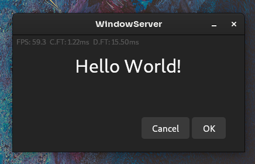

# Bold UI

UI Framework based on a client-server scene-graph model.

This is not a Javascript framework, it is language-independent networking protocol with a Python implementation.

Here's an example snippet (Work in progress):

```python
@widget
def main_page():
    def clicked(_):
        print('Clicked!')

    return Stack([
       # Background
       Rectangle(color=0xff242424),

       # Contents
       Padding(
          all=32,
          child=Column([
             # A big title
             Text('Hello World!', font_size=32),

             # Make some space
             # FIXME: Add space distribution parameter to `Column`
             Flexible(flex_y=10),

             # A row of buttons
             Row([
                Flexible(),  # FIXME: Add alignment parameter to `Row`
                TextButton('Cancel', on_mouse_down=clicked),
                SizedBox(child=None, width=4),
                TextButton('OK', on_mouse_down=clicked),
             ]),
          ]),
       ),
    ])
```

Which looks like:



## What?

The framework is split into a client and a server.

- The client is turns a scene-graph into pixels on a window, and converts raw input events into high-level app events.
- The server produces a scene-graph using a flutter-like widget tree, and consumes app events to update the scene-graph.

The client and server may communicate over a local UNIX domain socket, or over the internet.

The scene-graph contains draw commands (such as `draw rectangle`, `draw path`, `define clickable area`), but instead of
constants in the parameters of the commands, it has expressions that depend on client-side data such as window size or time.

This lets the client render high-framerate graphics even in bad network conditions or unoptimized server-side programming.

## Why?

1. **A reliable app framework:** If either the UI or app crash, the other can keep running until it restarts.
    * If the data source of truth is also seperated into another process or stored in an ACID database, app crashes can be transparent to the user (with no data lost!).
2. **A remote-desktop protocol:** Networked X11 is insufficient for modern app designs, and RDP is proprietary and complex.
3. **A separately updated UI framework:** If new requirements (E.g. Fractional scaling, VR/AR, etc.) become relevant it can be implemented once for all apps.
4. **Fast startup:** A cached scene-graph can be shown while a heavy app server is loading (such as Python or Java)
5. **Instant response over remote desktop:** The client knows how to draw the UI when resizing, etc.
6. **Flexible programming style:** Multiple ways of making a scene graph can be tested (Flutter / React / HTML / etc.) without reinventing the renderer.
7. **Simple to implement:** Should be easy to port to other runtime environments, even using other drawing libraries.

## How?

### The scene-graph protocol

Currently, it's a JSON object because I don't want to commit to a binary protocol yet.

Here's a small example:

```json5
{
   "oplist": [
      10,                                 // Expression #0
      {"type": "var", "name": "width"},   // Expression #1
      {"type": "sub", "a": 1, "b": 0},    // Expression #2 (uses results of expr #0 and #1)
      {"type": "var", "name": "height"},  // Expression #3
      {"type": "sub", "a": 3, "b": 0},    // Expression #4 (uses results of expr #0 and #3)
      4288716960                          // Expression #5
   ],
   "scene": [
      {
         "type": "rect",
         "rect": [
            0,  // Use expression #0
            0,  // Use expression #0
            2,  // Use expression #2
            4   // Use expression #4
         ],
         "color": 5 // Use expression #5
      }
   ]
}
```

The "width" and "height" variables correspond to the dimensions of the client window. Here we subtract 10 from both to
determine the right and bottom coordinates of the rect.

As you can see, this scene draws a rectangle with a 10px padding on all sides.

### The low-level Python API

Instead of manually writing the JSON scene-graph, here's the first abstraction:

```python
oplist = Oplist()
scene = [
   Ops.rect(
      rect=(
         oplist.append(10),
         oplist.append(10),
         oplist.append(var('width') - 10),
         oplist.append(var('height') - 10),
      ),
      color=oplist.append(0xffa0a0a0)
   ),
]
scene = {'oplist': oplist.to_list(), 'scene': scene} 
```

This has two abstractions:

- Builder functions for the JSON objects
- Simple expression syntax (overloaded operation methods)
- Automatic oplist builder with deduplication

### The high-level Python API

The API above isn't very scalable because all coordinates are relative to the global scene dimensions. Instead we can
use a flutter-like layout protocol to make the layout declaratively, like so:

```python
scene = Padding(
     child=Rectangle(0xffa0a0a0),
     left=10, top=10, right=10, bottom=10
 ),
```

This "compiles" to the same scene-graph from above, because of the expression abstraction from before.

Special care is needed when writing complex layouts though, to keep expressions from exploding in size. The oplist has
deduplication which should help with this.

### The built-in widget library

I intend to implement the GNOME HIG (Adwaita) as a module inside the library (strictly optional, of course), to provide
a basic widget set that is written with expression efficiency in mind. Currently only `Button` and `TextButton` are
implemented, and have no animations yet.

### The data store

Responsive static UIs are nice and all, but most apps deal with data.

To guarantee data durability, we use a lightweight yet properly ACID key-value database ([LMDB](https://lmdb.readthedocs.io/en/release/)).

It looks like this:

```python
class Model(BaseModel):
    counter: int


@stateful_widget
def main_page(model):
    def increment(_):
        model.counter += 1

    return Stack([
        # Background
        Rectangle(color=0xff222222),

        # Counter
        Center(
            EventHandler(
                on_mouse_down=increment,
                child=Text(text=model.bind('counter').to_str(), font_size=24),
            ),
        ),
    ])

if __name__ == '__main__':
    app_model = Model.open_db('/run/user/1000/example_app.db')
    app = App(lambda: main_page(app_model), durable_model=app_model)
    app.run()
```

We define a model, each field is given an ID (which becomes the key in the DB), and each field can either be read/modified (Like `model.counter`) or be used to create a binding (Like `model.bind('counter')`).

Bindings save a widget rebuild if the value changes, the app simply notifies the client the of new value, and it redraws accordingly. 

The model cannot contain lists (at least at the moment), just `int`s, `float`s, `str`s, and other subtypes of `BaseModel`.

The model can only be read/modified in the `build` function and in event handlers (only on the main thread!).

I plan to add sqlite support for relational / bulk data, hopefully with a nice API and DX like CoreData.

Both databases will need migrations, since app updates will break the model key mappings.

### Resource saving

The apps use `systemd-socket-activate` to launch themselves only when a client connects to the app socket.

(feature below is not implemented yet)

The app will detect inactivity and turn itself off after notifying the client. This frees the RAM the app took, but still
lets the client wake back the app if it becomes focused (with the socket activation feature).

### Running the example

```shell
systemd-socket-activate --listen="$XDG_RUNTIME_DIR/boldui.hello_world.sock" python3 example_framework_store_counter.py & python3 uiclient/main.py "$XDG_RUNTIME_DIR/boldui.hello_world.sock"
```